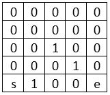

# A * Search Algorithm
An implementation of this is given in the file `A star.py`

## Introduction
You  would like to plan the path for a robot to move from point A to B. Given a map of the space, how would you find your path?

Consider the "map" above, where s is your robot's starting point and e is your desired end point. 0 are possible areas for your robot to traverse while 1 represents walls.

## The simple / brute force algorithm:
The simplest method would probably be something like this:
1. From the start point, expand in all directions unless it is not allowable (e.g. a wall, edge of the map)
2. Keep track of the direction you moved for all steps along the expansion
3. Trace back your path from the end point back to the start

This will work, but can be quite inefficient. Tracking how the above method searches, we have the following:

The numbers show the steps the simple search method took starting from 0. -1 refers to locations where the algorithm did not go, either due to a wall or because the end point was found before it got to that location.

## The A * search algorithm
How do we improve this? A simple way to do so is to introduce a heuristic to aid your search by giving you an idea of the general direction to move in to find the end point. This is the basic idea behind the A * search algorithm. For example, we could measure the distances from each and every point on the map to the goal assuming that the robot can only move in the x and y direction. (This is also known as the Manhattan Distance)

With this information, we can now incorporate it into our algorithm and always move in a way that decreases our overall distance to the desired end point, resulting in an algorithm like the below:
1. At each step, keep track of the expected distance required to get to the end point for your path by adding together the number of steps taken so far and the distance given by the heuristic.
2. From the start point, expand in a direction that reduces the total expect distance unless it is not allowable (e.g. a wall, edge of the map)
3. Keep track of the direction you moved for all steps along the expansion
4. Trace back your path from the end point back to the start

This results in the below steps taken. Look how much more efficient it has become!

Now, of course there are cases where this could backfire on you. For example, if there is a dead end right before the end point and you have to backtrack. However, most of the time this results in a much more efficient way to find a path from your start point to the end point.

###### Credit: Udacity's free course on Artificial Intelligence for Robotics
